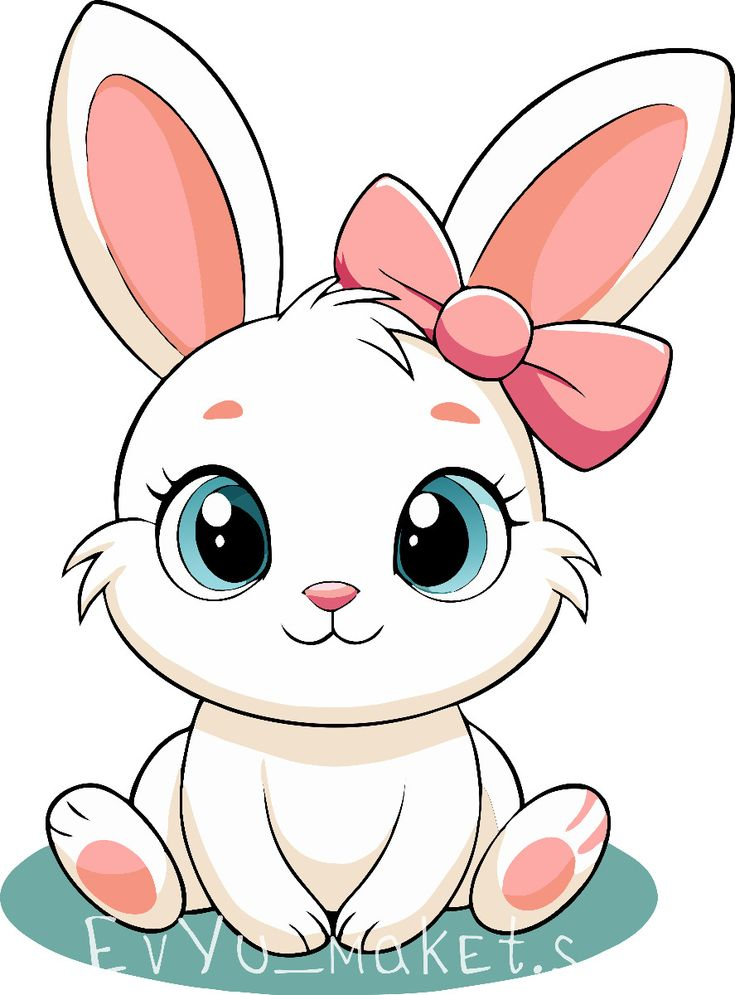

# valentine[code.html](https://github.com/user-attachments/files/25062807/code.html)
  [code.html](https://github.com/user-attachments/files/25062810/code.html)
<!DOCTYPE html>
<html lang="en">
<head>
  <meta charset="UTF-8" />
  <meta name="viewport" content="width=device-width, initial-scale=1.0" />
  <title>Valentine Week Surprise 💖</title>
  
</head>
<body>

  

  

    

      <!-- Bunny -->
      

        
      

      <h1 id="dayTitle"></h1>
      

      
<strong>Will you be my wife? 💍❤️</strong>

      

        <button id="yesBtn">Yes 💖</button>
        <button id="noBtn">No 🙈</button>
      

      

    

  

  
</body>
</html>
